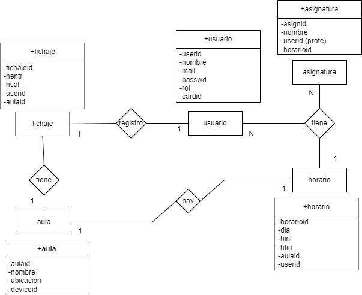

# Repository_BBDD

Repositorio datos de la base de datos Grupo 1 - Aula 02

Este repositorio contiene información sobre la base de datos y como funciona, la idea es mantener un control de Alumnos, Profesores y Administradores sobre un colegio con un sistema de regitro de registro a traves de tarjetas RFID

El modelo relacional que sigue la base de datos es el siguiente (nota: los atributos en fichaje.userid y fichaje.aulaid son incorrectos en la foto, realmnte son fichaje.cardid y fichaje.deviceid)

Primero, empezando por la izquierda fichaje-usuario, haciendo esto ya tenemos un control de quien es el que esta fichando, ya que la tabla fichajes está pensada especificamente para las entradas que realice el arduino. Luego tenemos fichaje-aula, al igual en parte que con usuario, con esto sabemos donde se esta fichando, asi en la tabla de fichaje sabemos el quien y donde

A la derecha arriba, existe una ternaria usuario-asignatura-horario, con esto sabemos que clases son a que hora y el profesor que las imparte o el alumno que el atiende.

Por último, para saber que clases son donde, tenemos la relacion de aula-horario para saber a que horas se han realizado según el aula.

